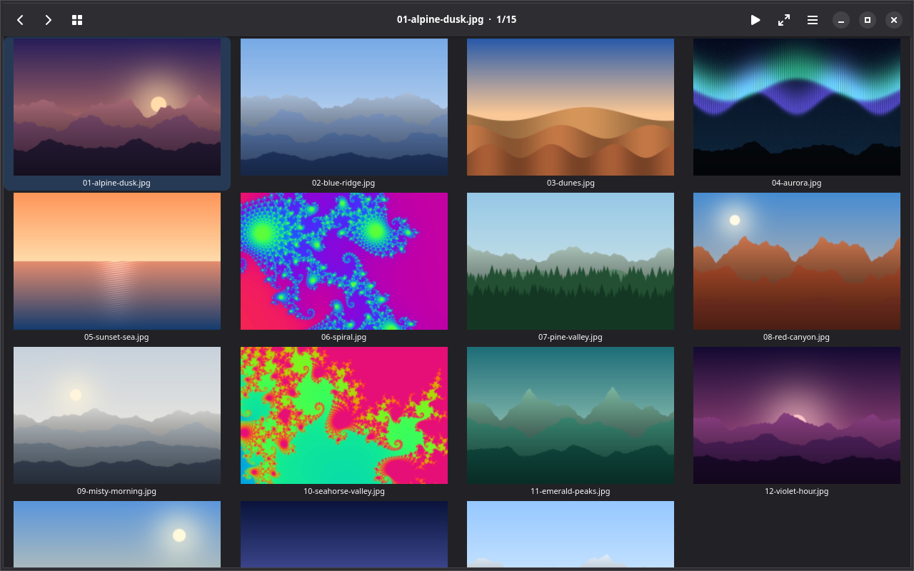
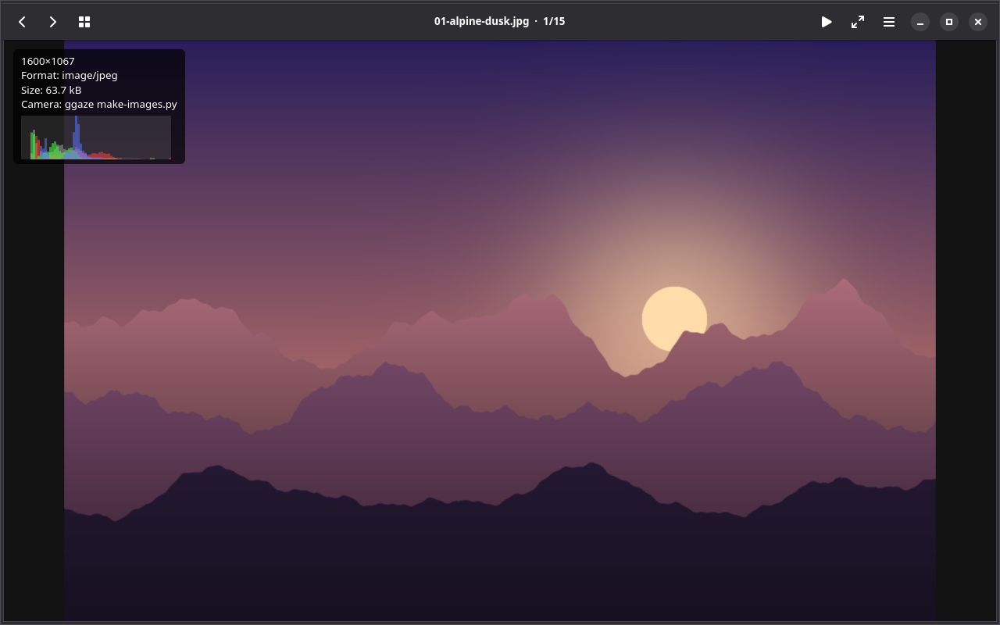

# ggaze — GTK Gaze

A small, fast, native image viewer for Fedora Linux, written in C with GTK4.
Its job: **quickly preview a folder of pictures downloaded from a camera,
cull the rejects, move on.** Think `feh` / `nsxiv` / `qiv`, but GNOME-native
and KISS — no library, no database, no sidecars. The layout nods to gthumb
(header bar, thumbnail grid, full-window viewer) without the weight.





*The thumbnail grid, and the large view with the info overlay (`i`). The
pictures are procedurally generated; `docs/screenshots/make-screenshots.sh`
re-renders them and re-takes both shots under Xvfb.*

> **Status:** usable for its core job (browse, cull, move, open externally,
> run scripts, quick GEGL enhance, crop / straighten / rotate 90°). Animated
> GIF/WebP play in the large view; thumbnails and everything else use the
> first frame.

## Quick start

```
ggaze ~/Downloads/Camera/IMG_0001.jpg
```

`ggaze FOLDER` opens the folder as a grid; `ggaze FILE...` (several files,
or a multi-file drop onto the window) opens the first file's folder in the
grid with that file selected — the first entry decides the folder, the rest
only ask for the grid.

### Install on Fedora (local user + GNOME launcher)

```sh
./packaging/install-fedora.sh
```

Installs build deps (via `dnf`), builds, and installs into `~/.local` by
default — including `org.buetow.ggaze.desktop` and the `ggaze` app icon so
the app shows up in the GNOME Activities overview. Override with
`PREFIX=/usr/local` (needs write access) or skip packages with `SKIP_DEPS=1`.

Opens the folder as a thumbnail grid, `Enter` drops into the large view, and
you flip through the shoot:

Keyboard first: every action has a vi-style key and a traditional one
(`?` shows the full, always-current table). The most used:

| Key | Action |
|-----|--------|
| `h` / `l`, `←`/`→`, `PgUp`/`PgDn` | previous / next image |
| `g` / `G`, `Home` / `End` | first / last image |
| `Enter` / `Esc`    | grid → large / large → grid (`t` toggles; `Esc` twice in the grid quits) |
| `j` / `k`, `↓`/`↑` | cursor row down / up (grid) · pan (large) |
| `H` / `L`, `Shift+←`/`→` | pan left / right (large) |
| `+` / `-`, `Ctrl+±` | zoom in / out (large) · grow / shrink thumbnails (grid) |
| `0` / `Ctrl+0`     | zoom fit ↔ 100% (large) · reset thumbnail size (grid) |
| `i`               | toggle info overlay (EXIF + colour space + RGB/luminance histogram) |
| `v` / `V` / `Ctrl+a` | mark / range-mark / mark all |
| `d` / `Delete`     | trash to `.Trash` (undoable), then next |
| `D` / `Shift+Delete` | delete permanently |
| `u` / `Ctrl+z`     | undo last `d` or `m` — with the edit panel open, undo the last **edit step** instead |
| `U` / `Ctrl+Shift+Z` | redo the edit step undone last (edit panel open) |
| `E`               | empty this folder's `.Trash` (asks first) |
| `m`               | move marks → destination popup (`1`, `2`, …) |
| `e`               | open in external program popup |
| `!`               | run a shell script popup |
| `Ctrl+c`          | copy image (or marked files) to the clipboard |
| `a`               | the GEGL **edit panel** (optional): presets, crop, straighten, rotate, save, revert — every button shows its key, and a key-hint bar under the image lists the live keys |
| `1`–`8`           | toggle preset N (layered) — only while the edit panel is open (large view) |
| `c`               | crop tool (GEGL; opens the panel): drag, or `h`/`j`/`k`/`l` move, `Shift+h/j/k/l` grow / `Ctrl+h/j/k/l` shrink that side, `a` cycles the aspect (free, 1:1, 3:2, 4:3, 16:9, original); `Enter` applies, `Esc` cancels |
| `r`               | straighten tool (GEGL; opens the panel): drag along the horizon or `h`/`l` nudge ±0.5°, `a` auto-crop; `Enter` / `Esc` |
| `]` / `[`         | rotate 90° clockwise / counter-clockwise (GEGL, non-destructive; opens the panel; repeat for 180°/270°) |
| `x`               | revert every edit (edit panel open, large view; `u` undoes it) — `Esc` closes the panel and **keeps** the edit |
| `s` / `Ctrl+S`     | save an edited copy — presets, crop, straighten and rotation composed (original is never modified; a saved preview no longer prompts; with GEGL a PNG/JPEG copy keeps its embedded ICC profile) |
| `Space` (hold)     | compare original vs modified |
| `f` / `F11`        | fullscreen |
| `S` / `F5`         | slideshow |
| `o` / `O`          | open image / open folder dialog (`Ctrl+o`, `Ctrl+Shift+o`) |
| `,`               | preferences |
| `F10`             | main menu |
| `?` / `F1`         | shortcuts overlay |
| `q` / `Ctrl+q`     | quit |

On a touchscreen: pinch to zoom, swipe left / right for the next / previous
image, tap with two fingers for the info card.

Full keybindings and mouse/touch gestures: `docs/ui-and-interactions.md`.

## Install

Install the Fedora build dependencies (see below), then from the checkout:

```sh
make install                      # release build into ~/.local (no root)
sudo make install PREFIX=/usr/local   # or system-wide
make update                       # git pull, rebuild, reinstall
make uninstall                    # remove what the last install put in place
```

`make` alone just builds (`build-release/`), `make test` runs the unit tests.
Optional backends (GEGL, JPEG XL, AVIF, HEIF, libjpeg) are used when their
`-devel` packages are installed; override with e.g.
`make install MESON_OPTS="-Dgegl=disabled"`. With the `~/.local` prefix,
make sure `~/.local/bin` is on your `PATH`; the desktop entry, icon, man page
and GSettings schema land under `~/.local/share`.

## Build

```sh
meson setup build
ninja -C build
meson test -C build          # all tests
meson test -C build --suite unit
meson test -C build --suite integration
```

A minimal build (GdkPixbuf-only, no GEGL, no libjpeg) is valid and fast,
and is what the minimal CI lane builds:

```sh
meson setup build -Dgegl=disabled -Djxl=disabled -Davif=disabled -Dheif=disabled -Djpeg=disabled
```

Enable optional backends with the matching feature option (`auto` by default):

```sh
meson setup build -Dgegl=enabled
```

Coverage (plain-C modules, ≥80% target):

```sh
meson setup -Db_coverage=true build-cov
ninja -C build-cov
meson test -C build-cov
ninja -C build-cov coverage     # needs lcov + genhtml
```

## Dependencies (Fedora)

```
meson ninja-build gcc pkgconf-pkg-config desktop-file-utils
gtk4-devel glib2-devel libadwaita-devel libexif-devel
# optional:
gegl04-devel babl-devel   libjpeg-turbo-devel
libjxl-devel   libavif-devel   libheif-devel
# checks (CI): clang-tools-extra (clang-format) xorg-x11-server-Xvfb
```

## Documentation

The full design lives in `docs/`:

- [`docs/PLAN.md`](docs/PLAN.md) — living tracker + decisions log
- [`docs/IMPLEMENTATION.md`](docs/IMPLEMENTATION.md) — execution plan (this repo's roadmap in practice)
- [`docs/goals-and-scope.md`](docs/goals-and-scope.md) — what ggaze is and is not
- [`docs/architecture.md`](docs/architecture.md) — modules + data flow
- [`docs/ui-and-interactions.md`](docs/ui-and-interactions.md) — views, keybindings, gestures
- [`docs/tech-stack.md`](docs/tech-stack.md) — libraries, decode backends, settings keys
- [`docs/coding-conventions.md`](docs/coding-conventions.md) — C style
- [`docs/gegl.md`](docs/gegl.md) — optional GEGL enhance plan
- [`docs/open-questions.md`](docs/open-questions.md) — undecided items

Contributing and agent workflow: see `AGENTS.md`.

## License

GPL-3.0-or-later. See [`LICENSE`](LICENSE).

